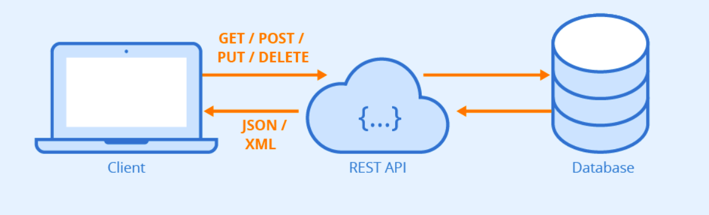
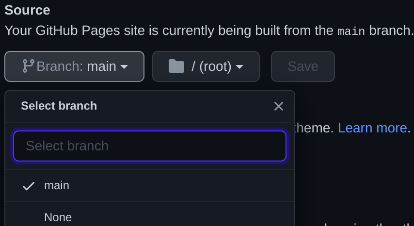
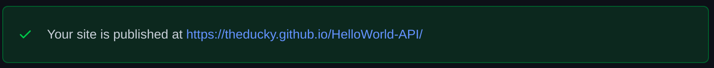

# Welcome to HelloWorld-API 

## Project Info 

This is a simple tutorial where we will learn how to make a json REST API and host it on github pages. 

To do this we first need to understand the fundamental concept on what Json and API's are.



> A REST API (also known as RESTful API) is an application programming interface (API or web API) that conforms to the constraints of REST architectural style and allows for interaction with RESTful web services. REST stands for representational state transfer and was created by computer scientist Roy Fielding.
> 
To read more about REST and REST API [click here]

>JSON (JavaScript Object Notation) is a text-based data exchange format. It is a collection of key-value pairs where the key must be a string type.
>
To read more about Json [click me]

once you have visited this site you will have sufficient knowledge on making a working json file.

## Project structure
You can make the structure however you want but the key files that are a must to include are `index.html` and `*.json`

**I personally like to organize my files in this format**

<pre>
.
├── APIs
│   └── *.json
├── icons
│   ├── img1.png
│   ├── icon.svg
│   └── img2.png
├── index.html
├── style.css (if needed)
└── (All the other files)
</pre>

## Lets begin :D


1. First, make a new repo and clone it to work on it offline.

2. Them make a basic webpage like so..
```html
index.html
-----------------------------------------------------------------------------------
<!DOCTYPE html>
<html lang="en">
<head>
    <meta charset="UTF-8">
    <meta http-equiv="X-UA-Compatible" content="IE=edge">
    <meta name="viewport" content="width=device-width, initial-scale=1.0">
    <title>API</title>
</head>
<body>
    <h1>Hello World!</h1>
    <a href="web address to your .json file">Go to API</a>
</body>
</html>
```

3. Now its time to add the .json file to store all your data. <br> 
Example:
```json
data.json
-----------------------------------------------------------------------------------
{
    "Python": [
        {
            "ln": 1,
            "Code":"print(\"Hello World!\")"
        }
    ],

    "Java": [
        {
            "ln": 2,
            "Code":"public class Main {\n    public static void main(String[] args) {\n\tSystem.out.println(\"Hello World!\");\n    }\n}"
        }
    ],
} 

```
4. After all this we need to host the webpage in order to get the data. To do this we are gonna use github pages which is a free website hosting solution. 
- Start by going to the /settings/pages of your repo and find 'Source' 

    

- Select your main branch and click on save.
- And thats all! Your webpage should be running. everytime you commit a change github pages will automatically to the same for the webpage.

    

### Get the data form the API to the client system.

To do this i am going to you python but you can use anything you like.

```python
#!/usr/bin/python3

import requests # Import the requests librar.
        
req = requests.get("https://webpage.com/data.json")
dct = req.json() # Add the link to the .json file and load it up.

pst = dct["Python"] 
pst2 = dct["Java"][0]["Code"] # Line 8 and 9 are used to get the data form the json file and store it in variables

print(pst)
print(pst2) # a=And finally print the data contained in the variables.
```

### Thank you for reading my tutorial :)
<!-- Resources -->
[click here]:https://www.redhat.com/en/topics/api/what-is-a-rest-api

[click me]: https://www.freecodecamp.org/news/what-is-json-a-json-file-example/